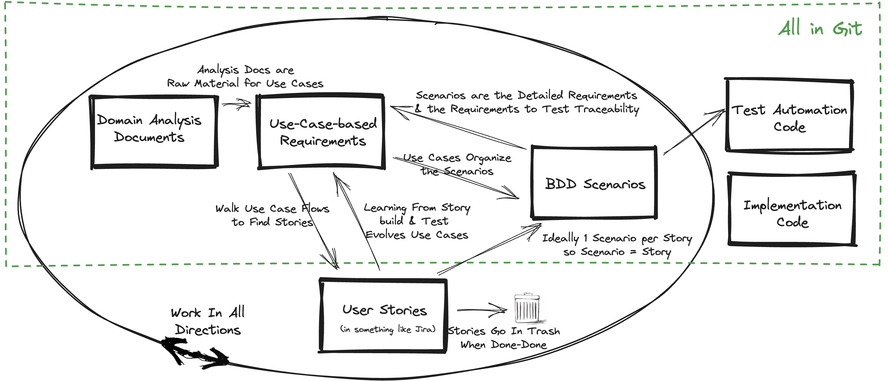
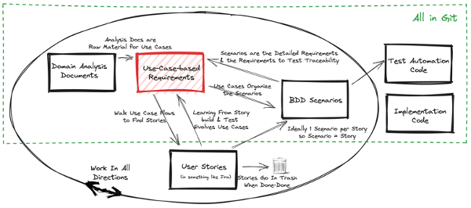
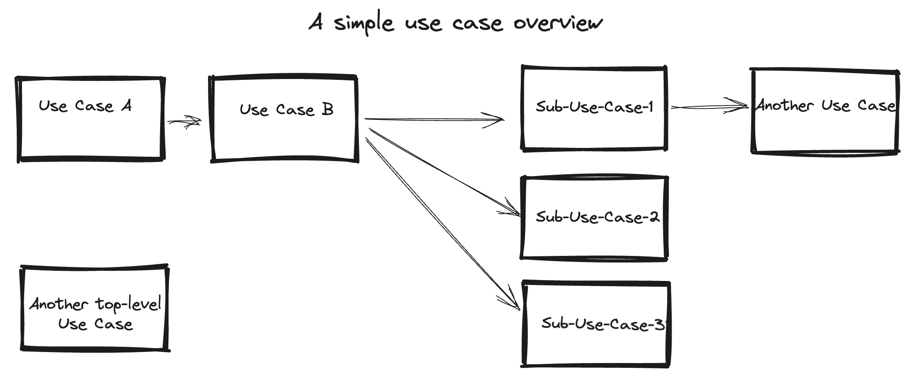
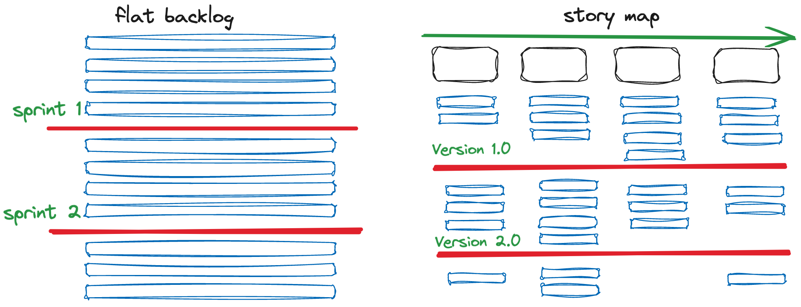
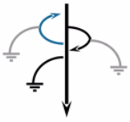
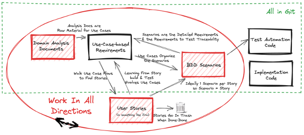
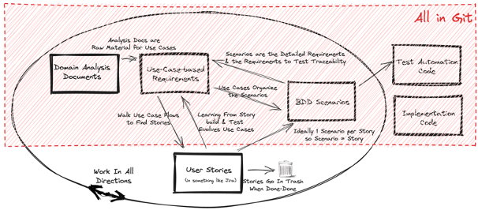

        

          <a href="#real-agile-with-a-comprehensive-requirements-framework" class="md-toc-link">
Real-Agile with a Comprehensive Requirements Framework

</a>
          

        

          

          <a href="#why-do-we-need-comprehensive-requirements" class="md-toc-link">
            
Why Do We Need Comprehensive Requirements

          </a>

          <a href="#user-stories-as-requirements" class="md-toc-link">
            
User Stories as Requirements

          </a>

          <a href="#waterfall-style-requirements-documents" class="md-toc-link">
            
Waterfall Style Requirements Documents

          </a>

          <a href="#approaches-between-the-extremes" class="md-toc-link">
            
Approaches Between the Extremes

          </a>

          <a href="#use-cases" class="md-toc-link">
            
Use Cases

          </a>

        

          <a href="#benefits-of-the-framework" class="md-toc-link">
Benefits of The Framework

</a>
          

        

          

          <a href="#use-cases-as-a-better-backlog" class="md-toc-link">
            
Use Cases as a Better Backlog

          </a>

          <a href="#work-in-all-directions" class="md-toc-link">
            
Work In All Directions

          </a>

          <a href="#store-everything-in-git" class="md-toc-link">
            
Store Everything in Git

          </a>

          <a href="#work-management" class="md-toc-link">
            
Work Management

          </a>

          <a href="#automate-all-artifact-creation" class="md-toc-link">
            
Automate All Artifact Creation

          </a>

          <a href="#shift-requirement-details-to-the-automated-tests" class="md-toc-link">
            
Shift Requirement Details to the Automated Tests

          </a>

        

      

    
        

      

    

        

          <a href="#closing-thoughts" class="md-toc-link">
Closing Thoughts

</a>
          

        

          

          <a href="#why-is-this-a-great-requirements-framework" class="md-toc-link">
            
Why is this a Great Requirements Framework

          </a>

          <a href="#relationship-to-agile-frameworks" class="md-toc-link">
            
Relationship to Agile Frameworks

          </a>

          <a href="#challenges-to-adoption" class="md-toc-link">
            
Challenges to Adoption

          </a>

        

      

    

# Real-Agile with a Comprehensive Requirements Framework

Products[^product-project] need comprehensive requirements specifications. Not an up-front waterfall spec. Rather a *continuously evolving* framework of requirements specifications that organize the path to building the product. 
User stories as used in current agile processes cannot accomplish this because they need to drive short term work management rather than be a fully connected requirements story; I will detail my reasoning by describing a way-of-working to build comprehensive requirements that is compatible with an agile way-of-working in this article. 

First let me define what I mean by the words in the title. My definition of *Real-Agile* is based on the ideas from those I consider the master craftspeople of agile ways-of-working[^masters-of-agile] :
- Incrementally learn what the user needs via small user stories defined via [Behavior Driven Development (BDD)](https://cucumber.io/blog/bdd/better-requirements-by-harnessing-the-power-of-exa/) scenarios.[^abandon-agile] 
- Deliver running, tested, useful software very frequently, ideally at least daily
- Assume requirements, design, and code evolve constantly.[^rat-trap]

My definition of *Comprehensive Requirements* is a document(s) that cover the full scope of the product as a connected journey[^system-must], spanning all the releases. 

  [^masters-of-agile]: I primarily consider the signers of the agile manifesto to be the master craftsmen of agile. Few of them are Scrum advocates and even fewer like SAFe. I share those views. The people I have taken most of my ideas from are: [Ron Jeffries](https://ronjeffries.com/) and [GeePaw Hill](https://www.geepawhill.org/).

  [^abandon-agile]: It's summed up by Ron's article: [Developers Should Abandon Agile](https://ronjeffries.com/articles/018-01ff/abandon-1/).

  [^rat-trap]: Don't fall into the RAT trap, see GeePaws article: [Rework Avoidance Theory](https://www.geepawhill.org/2020/07/17/the-rat-rework-avoidance-theory/)

  [^product-project]: Rather than repeat 'product / project', I'm going to say 'product'. For discussion of why 'projects' are a bad idea, see sources like: [Product rather than Project Teams](https://www.svpg.com/product-vs-project-teams/), [Product Mindset](https://www.accenture.com/us-en/blogs/software-engineering-blog/whats-the-difference-between-a-project-and-a-product)

  [^system-must]: It cannot be a long list of 'the system must...' statements. 

> Note: This article does not get into details on roles and team structures. The assumption is that there are Subject Matter Experts (SMEs) for the domain as a permanent part of the team and that someone is acting in a Business Analyst role to write the requirements. No approach to product building is going to work if you don't have this in place. 

## Why Do We Need Comprehensive Requirements

Formally, many domains mandate a requirements documents, e.g., I primarily work in the regulated / validated Life Science domain where, among other mandates, there must be a requirements document. Informally, we need requirements because humans forget things and these forgetful humans routinely leave and join our product team. Without something like a requirements document to provide the overarching goals and enough of the details, we lose track of what we've done and why and we struggle to see how new work should fit in.[^help-doc]  In this article I'll go beyond just meeting the mandates and make the case that a comprehensive requirements document makes every step of an agile way-of-working better. 

  [^help-doc]: It's possible for the user guide to provide the info on what a product does, I've never seen one written as the system was built. Further, the organization provided for things like traceability don't map well to a user guide. I'm interested to hear about the user guide as the substitute for requirements.

I see little discussion or innovation on the need for comprehensive requirements when working agile. What I see way too often are two extremes:
- User Stories in a tracking tool as the requirements, e.g., Jira,
- Waterfall style requirements documents, usually captured in a Word document or an application life cycle management (ALM) tool, e.g., [Confluence](https://www.atlassian.com/software/confluence)

Let's examine the issues with each of these requirements approaches.  

## User Stories as Requirements

What I see at many companies is a process that mashes together the user stories from the tracking tool into a 'requirements document'. I'd go so far as to say that this is the current standard practice for most companies that need requirements documents and are trying to maintain an agile way-of-working. While it's the easy approach, it doesn't work because *user stories are NOT requirements*! Stories don't work as the requirements because:
- They are the understanding at a point in time. They are expected to be incomplete and to evolve so the real needs can be discovered. With user stories, we are supposed to step away from requirements and enter the world of experiments that aim to prove a hypothesis. 
- They are supposed to be small and separately deliverable. They represent small increments of valued functionality that can be developed in a period of a day to a week based value, risk, unknowns, etc. Their delivery order doesn't need to reflect the user requirements. As such they are more planning instruments than requirements.  
- They should not be maintained. They should be thrown away after implementation. (Anyone remember tearing up the story cards-on-the-wall at the end of a sprint.) As such they can't be the basis of comprehensive requirements without a lot of re-work. 
- Epics (groups of related user stories) don't show how user stories are sequenced and interconnected in a connected flow that serves as good requirements. 
 
Avoiding user stories as the requirements should be an easy topic. Since so many companies that are trying to work agile and need requirements documents, it seems a more detailed discussion is needed, see [Stories Are Not Requirements](./supporting-articles/stories-are-not-requirements.md).

## Waterfall Style Requirements Documents

At the other end of the spectrum is creation of traditional up-front requirements documents, a.k.a. waterfall. These take the form of [Business Requirements Documents (BRD), Functional Requirements Documents (FRD), Software Requirements Specification (SRS)](https://babeginners.com/difference-between-brd-frd-and-srs/). This kind of document doesn't fit an agile way-of-working. They are used because of a combination of:
- Fixed-price, fixed deliverable, fixed duration contracts,
- Fear of compliance with regulations,
- Standard operating procedures combined with management preferences that mandate requirements up-front.

Agile came into existence because we learned that requirements cannot accurately be specified up front. I see little hope for combining these types of requirements documents with an agile way-of-working.  

## Approaches Between the Extremes

If we're not going to take the easy but wrong approach of user stories as the requirements or cripple the agile way-of-working with a waterfall style, we need to find something between these extremes. We need to capture the requirements in a way that fits with an agile way-of-working but doesn't create massive overhead. 

The purpose and value of capturing requirements changes as we work on a product. As we are getting started in each unit of work, be it as small as a sprint or as large as multiple releases, writing things down is a powerful thinking tool in the iteratively learning process. We can't get all the details right before we implement so the requirements framework needs to strongly support working iteratively and incrementally. After we're done it needs to naturally serve as the documentation of what we've built. With that in mind we can list the 'ilities' for a great requirements framework:

- *Evolvability*: You can start with just parts of the overall requirements and easily split, combine, and otherwise refactor them. I sometimes refer to this as 'Survivability'. The requirements framework needs to make it easy to evolve almost everything because the agile approach means constant learning and hence requirements changes. If it doesn't, you won't survive the project.

- *Longevity*: The requirements grow and evolve naturally over many releases.

- *Automateability*: You can use tools to reformat, add to, subset and otherwise transform the requirements.

- *Work Manageability*[^manageability] : The user stories are the right way to track and manage work. They can be easily derived from the requirements. 

- *Flexibility*: The requirements can be easily created during or after other forms of requirements definition, e.g., you can start with some high-value user stories and work back into the full requirements framework as you learn by implementing. 
 
- *Traceability*: Acceptance tests and design documents align directly to provide simple traceability from the requirements.
 
- *Price*: While not an 'ility', the framework should require spending the least amount on special tools. Less use of special tools also tends to result in portability.
  

    [^manageability]: 'Work Manageability' isn't an ideal name. Forgive me for trying to force everything into 'ilities'.

To meet all the above we need a framework rather than just a requirements document. The following are practices I've tried and that I consider essential to get to such a framework:
- User stories linked to web pages / documents that contain the details about the requirements, e.g., a story in Jira linked to a page in Confluence. Carefully written pages could yield a good view of the requirements. This is attractive because a story should be a placeholder for a conversation so it's good to minimize the details in a story by moving them to another document. This approach doesn't yield good requirements if the documents are largely organized by the user stories. Such an organization is just a more documented version of the problem that user stories are not requirements. I've routinely seen such requirements documentation be difficult to follow and poorly synchronized with the state of the product.

- [Story Mapping](https://jpattonassociates.com/story-mapping/) - This is very attractive because it organizes the user stories into end-to-end journeys. I highly recommend learning about story mapping and applying those ideas in combination with the requirements framework proposed in this article. The creator of story mapping describes it as: "A story map helps teams decompose feature ideas into smaller buildable parts, and best choose the subset of parts that will result in a successful product release." You learn about it by following this bullet's link to Story Mapping. I've seen only limited use of story mapping in the wild. It requires a specialized tool to support it. While all the core ideas work for me, I have one big issue with it. It suffers from the fundamental problem of being based on user stories, so the journeys are a chopped up into a work management view of the requirements.
  
- [Domain Analysis Documents](https://www.amazon.com/How-Understand-Almost-Anything-Practitioners/dp/B0C2RBL5KC) - This is essentially the fundamental work of doing business analysis. The link for this bullet points to a new and excellent book on the topic. It extends traditional analysis with powerful ideas and techniques focused on the language of the business. The description of the book says: Domain analysis is the process of understanding a body of knowledge, the subject matter of a domain. Minimally you want to document everything you are agreeing to implement in whatever format works for that domain. Ideally, you want to capture the concepts, vocabulary, rules and constraints clearly enough so you can define a set of abstractions and their relationships. The goal is to document the *language* that can be used to completely and unambiguously describe, and ultimately execute, the subject matter in the domain. You follow a set of practices to enable you to write everything you know about the requirements as you learn them. Analysis of the domain is fundamental for any product building process. For the requirements framework there is no magic way to balance writing too much or not enough. We don't want to require that big documents are written up front. You need to stay agile and evolve your analysis. For the requirements framework the key is to do enough to connect all the requirements for all the areas of the product together. 

- [Behavior Driven Development (BDD)](https://cucumber.io/blog/bdd/better-requirements-by-harnessing-the-power-of-exa/) - BDD is a way to capture business rules as a series of examples in a format that is both human readable and executable. BDD is the best approach for capturing detailed requirements. I believe that using each BDD scenario as a user story is an excellent approach. Having multiple BDD scenarios as the Acceptance Criteria for a story is my second choice. BDD is essential but it's hard to see how all the individual scenarios fit into the overall requirements so something more is needed. 

As noted above, these practices have limits that keep us from getting to the desired framework. My requirements framework meets all the 'ilities' by combining the Story Mapping, Domain Analysis Documents, and BDD centered around an updated approach to use-cases. I assume you are doing something like the above practices. If not then you need some combination of understanding them and actively starting to do them as part of moving to this more comprehensive framework. For example, if you use the framework you don't need to do story mapping because you'll get the equivalent from the framework vs. you must be doing BDD to use the framework.

The following picture provides an overview of the framework. Each part of it is discussed in the rest of the article. 

## Use Cases

Since deep integration of use cases are the novel part of the framework we'll explore them first. The following picture highlights the use cases in the framework. Use cases may seem like an outdated, big-requirements-up-front approach that can't align with real-agile. This isn't so in general and is especially wrong when you're working agile in a validated or regulated situation. 

 Writing good use cases requires doing good analysis and modeling of the domain. There is a lot of information on use cases available in books[^use-cases-details] and on the web, so I'll focus on the aspects related to how they fit into the framework. The essential idea is to build a structure like:

>  Use Case Name (a user goal)
>    -  Basic Flow (ideally the simplest or most common case)
>       - Step 1 (steps that an actor or the system does)
>       - ...
>       - Step N
>     - Alternative Flow (the flow starts off of some step in the Base Flow)
>       - Step 1...
>     - Other Alternative Flows (each with their own steps)
>

See [Working With Use Cases](./supporting-articles/writing-agile-use-cases.md) for details.  

  [^use-cases-details]: See the definitive book for [Writing Effective Use Cases](https://www.amazon.com/Writing-Effective-Cases-Alistair-Cockburn/dp/0201702258) by Alistair Cockburn and my [Writing Agile Use Cases](./supporting-articles/writing-agile-use-cases.md) article for detailed guidance of how I write them.

The main structure of a use-case-based requirements document are:
- A use case names a user goal. We decompose these goals into sub-use-cases. *Decomposition is essential to make things into manageable chunks for both easier reading and implementing.*
- Use cases are a linear sequence of steps (no branches). Decisions corresponding to branches are broken out as alternative flows. *Simple flows make everything simpler.*
- Use cases 'call' other use cases. The called use case is formatted as its name as a hyperlink. *This is a big part of telling the connected story.*
- Use cases that have complex data or rules are followed by a 'Data' sub-section. This data is referred to in use case steps as the name as a hyperlink. *This simplifies the steps and centralizes the definitions so that it can be reused in multiple places.*
- A use case is followed by a 'Detailed Requirement Statements' sub-section that lists the requirements statement for each BDD scenario associated with the use case.*This is how we capture all the details but keep the requirements document minimal.* I don't recommend doing a lot of work to organize the list of these requirements statements. I frequently don't even tried to break them out by alternative flows. Instead I have just one list per use case. This is an example of an effort vs. benefit vs. risk trade-off. The BDD scenarios should be evolving even more than the use cases and trying to keep them highly organized has proven unsustainable. Instead, the place to invest is the requirements statements in the BDD scenario. It's worth a lot of investment to make them readable and to fit into the context of the use case they are under.

The following is a simplified example of some use cases for a product to design configuration files. The idea is that a configuration is made up of many parts, each with a unique structure that the user needs to populate. I present the example first and then review how its structure provides the ideal requirements framework. 

---

>#### Access Configuration Designer 
> An example of a 'top-level' use case that calls other use cases.
>
>##### Base Flow - Access Designer
>
>1. User accesses Configuration Designer by browsing to [designer.com]() and enters valid credentials.
>2. User [Views or Edits Configuration](#view-and-edit-configuration).
>3. User closes the Configuration.
>1. User logs-out of the Designer
>
>##### Alternatives
>
>###### 1a - Setup Credentials
>
>1. ...
>
>##### Detailed Requirement Statements
>
>This section will list the requirements statement / business rule for each BDD scenario associated with the use case. It is automatically generated from the text at the beginning of each BDD scenarios.
>  - Configurations can be opened and closed from the Designer (Example of a Detailed Requirement Statement that would describe a BDD scenario)
>  - Accessing the Designer requires valid credentials.
>  - ...
>  - ...

>#### View and Edit Configuration
> 
> An example of a sub-use case. It is called by the *Access Configuration Details* use case.
>
>##### Base Flow - View and Edit Configuration
>
>1. User does any of the following by navigating to the appropriate part of >the configuration.
>     - [Views or Edits Part-A](#view-or-edit-part-x)
>     - [Views or Edits Part-B](#view-or-edit-part-x) (there would be more similar steps for other parts of the config...)
>     - [Imports a Configuration Part](#reuse-a-form-r12)
>     - [Views the Audit Trail](#view-audit-trail) 
>     - Other sub-use-cases that could be done...
>2. Other steps...
>
>##### Data
>
>###### Configuration (the name of a thing in the business domain)
>
> This is an example of what goes in a 'Data' sub-section. Splitting out the data from the steps isn't a standard practice when writing use cases. Such a section would contain things like the definition of the parts of a 'Configuration', navigation to and operations on those parts, e.g.,
>- Config 'Name' - with sub-folder for each of the following that when clicked navigate to and expand to show details of that part of the Config:
>    - Part-A
>      - Sub-parts would be listed here but are omitted to keep the example simple. Rules about the contents of each part could also go in this section.
>      - List the operations available on this part and its subparts. Details omitted to keep the example simple...
>    - Part-B
>      - ...
>    - Audit Trail of changes to Config (an example of other kinds of data that need to be defined)
>    - ...
>
>##### Detailed Requirement Statements
>
>BDD scenario associated with the use case....
>
> For details on how the detailed requirements are presented, see [Organizing and Managing BDD Scenarios As Your Detailed Requirements](./supporting-articles/scenario-as-detailed-requirements.md)
>
>
---

Ideally, you'll have a top-level picture of the use cases. Such a picture gives context of how the main use cases fit together. The picture need not, probably should not, show alternative flows or a lot of other details. It should not be a UML style use case diagram. It should be a flow with arrows connecting use cases. 

A picture is not testable so it doesn't need to be *correct*. Its job is simply to give the context and act as a graphical table-of-contents. Keeping it high-level and with minimal detail eliminates the need to constantly re-draw it as the use cases are refactored. You should not be doing a separate process-flow style picture for every use case. It is not worth the significant extra work of keeping a lot of pictures up to date and having them be correct enough to be valuable vs. just working with the text versions of the use cases.

## Benefits of The Framework

### Use Cases as a Better Backlog

The *flat* product backlog does not capture the customer’s journey. This problem and using story mapping as the solution has been written about extensively[^story-mapping-products]. 

The flat backlog provides no context or big-picture for a product. Arranging user stories in the order they’ll be delivered doesn’t help a product manager explain to others what the product does or determine if they’ve identified the relevant user stories. 

 The work on the use cases should start as a top-level list of user goals[^business-capabilities] similar to a regular flat backlog of epics and user stories. The result can be a backlog of use cases. They are incrementally expanded to be a connected set of more detailed use cases. This provides an even better organization of the product backlog that a story map, while setting us up to have comprehensive requirements.

  [^business-capabilities]: While there are techniques for capturing higher level business capabilities for an organization, that isn't necessary to deliver a product. It's a good higher level context but is outside the scope of this framework. 

Ordering the stories based on things like priority happens after the initial set of use cases is identified. That ordering is the beginning of work-management, e.g., put the user stories in priority order into a [work-management](#work-management) tool like Jira or use a story mapping tool instead.

When you have the some or all of the use cases before starting implementation of a feature it's easy to create user stories from them.  The first cut at user stories can be as simple as one story for the base flow and one for each alternative. The following picture shows the idea of such paths through the flows. My experience is that typically a flow get broken into smaller user stories. There are not hard-and-fast rules. A story can be a path through a flow or multiple flows. How you create user stories largely depends on the effort to implement and how splitting or grouping helps with work management.

[^user-story-map-picture-reference]:  https://www.linkedin.com/pulse/flat-backlog-vs-user-story-map-namit-kumar-csm-csp/

[^story-mapping-products]: see information from any of the story mapping products, e.g., [Easy Agile](https://www.easyagile.com/), or the work by the creator of [Story Mapping](https://jpattonassociates.com/story-mapping/) 

Factoring out the data and rules from the use case steps pays dividends here. Varying the data is an ideal way to find BDD scenarios that then become the automated tests. If, as I recommend, you are considering every BDD scenario a 'story' then walking paths through the use case flows with different data is a great way to find user stories and generate BDD scenarios. A powerful benefit is that you'll be walking through use case flows and this is likely to be a longer path than a single story thus yielding better, or at least more comprehensive, tests. 

Also important is that we aren’t working on all the use cases at the same time. We’re working on one goal at a time with minimal requirements on things to be built in the future. So the many parts of the requirements documentation could be just names of use cases that may get expanded in the future. This also makes review of the use cases easier. At any point in time we're only working on a small subset. The full set is there as the context but not changing much in a sprint(s).

Finally, we want to write the absolute minimum that provides a framework of the requirements as a way to control the overhead from constant refactoring of the use cases. The details should instead be migrated into the BDD scenarios that we link to the use cases. We might start with a lot of detail in the use case doc but look to move that detail out into BDD scenarios as much as possible as the implementation proceeds.

### Work In All Directions

While your goal should be to have decent use cases before starting implementation, this will frequently not be appropriate or possible. We may start by just writing a list of use cases and then evolve from all directions to update and refactor the use cases as we learn. Working-in-all-directions happens because every part of the framework is iterative and incremental. Up to a point, the more we have the opportunity to discuss and think deeply about what to build the better the foundation of understanding we start with. There is no magic answer to finding the balance between the waterfall big-requirements-up-front trap and the code-and-fail-fast that can lead to lots of wasted implementation work. This framework strives to help find that balance while setting up for rapid cycles of implementation and learning. It's also typical that features have wildly difference cycles depending on the amount of unknowns. Where the unknowns are limited, more upfront thinking can speed delivery. The following picture highlights all the other parts of the framework feeding into the use cases.

 Working in all directions means:
  - Write analysis documents about the domain in whatever way works and transform them into the use case structure over time, e.g., capture notes about a feature across a series of discussions before trying to organize them into use cases. For guidance see [How to Understand Almost Anything: A Practitioner's Guide to Domain Analysis](https://www.amazon.com/How-Understand-Almost-Anything-Practitioners/dp/B0C2RBL5KC) by Markus Voelter.
  - Since we don't know the requirements we build some working, tested features from whatever early user stories we have. As we learn what the real requirements are we reverse engineer the use cases from the implementation or user stories.
  - Constantly refactor the use cases as your understanding of the requirements evolves or as needed to make reading the requirements easier. 
  - Review the use cases and the user stories in the work management system together and make appropriate corrections in both. Do this frequently even if you thought you had the use cases at the start of work on a feature. 

### Store Everything in Git

Git unites developers, designers, managers, and QA engineers in industry, academic, and personal settings because of its broad utility. As a precise and flexible system to track and control the various versions of your code and documents, it is incredibly useful for collaborative projects being developed over time (so, most projects).Having the analysts and users working collaboratively in the same place as the devs and testers with a rapid feedback cycle is a *massive benefit*. Using different tools that aren't directly linked to the product substantially slow such a cycle. The simplest and I believe only way this is possible is to have everyone storing everything in the git repository. 

The changes needed to have everyone working in git is worth it. The devs and testers are already putting everything in git. The devs are putting their code there[^design-docs], the detailed requirements, as BDD scenarios, are also either be BBD scenario text files or actual code[^mps-tests]. Everyone collaborating in git becomes immediately possible when the requirements documents are text files written in markdown[^markdown] and managed in git.   

I can hear the response. Git is scary. Markdown is only for techies. My experience is that I can teach anyone how to use git and edit markdown quickly. The users don’t need to be git or markdown experts, just doing the basics gets us all actively collaborating in a much better way than separate tools. Anyone you trust to be writing requirements needs to have the skills to work in markdown. In the Life Science domain I primarily work in most of the users are really smart, e.g., scientists. If they see how working closely in tight feedback cycles gets them rapid results, they will learn something new. It’s a big but important change. I expect the situation is similar in most other domains.   

  [^design-docs]: The design documents are also be markdown documents stored in git. 

  [^mps-tests]: The typical BDD tools, e.g., Cucumber or Behave, have you write the scenarios in text based feature files. On a recent project all the BDD scenarios were written in a DSL running in the same language engineering tool as the product code. In this case the BDD scenarios generated HTML reports that were included in the 'Detailed Requirement Statements' section. See [Nodeworld: Adventures from a world with turtles all the way down](https://www.youtube.com/watch?v=x1qm879ZosI) for an details of the approach. This is also an example of the power of a custom DSL for testing vs. limiting yourself to BDDs Given-When-Then.

As a concrete example of what a tight feedback cycle looks like, consider the following:
- A change is needed to a BDD test scenario which is edited in a text file in git as the result of discussion with a dev and user
- The code is updated in git
- The system is rebuilt in response to those changes in git
- The automated test based on the BDD scenario is run as part of that redeployment  
- If it passes the product is deployed and the change is ready for ad-hoc evaluation

If the change is just a scenario addition or detail change, the use cases need not be updated. The change will be reflected by the scenarios presence under the appropriate use case. If the change impacts the use case, then they are easy enough to edit directly as part of the discussion about the change.  

There is a multitude of separate specialized tools to capture the requirements and the supporting details as BDD test scenarios. They don't store their artifacts in a text or code format in git. This results in disconnects between the product and its supporting artifacts. I expect every reader has seen requirements that are out of sync with the current implementation, especially for mature products. Having the detailed requirements be living, constantly executed, BDD scenarios is a major way this disconnect is avoided. Having these living BDD artifacts organized in a light-weight use case framework enables keeping the rest of the specifications in sync with the product. Another factor is the cost of separate tools, teams to support them, and user training. Working all in git using markdown eliminates all these costs.

  [^markdown]: See the many resources on the web on markdown, e.g., [The benefits and challenges of using markdown software](https://www.linkedin.com/advice/0/what-benefits-challenges-using-markdown-software ), [Why you should and should not use markdown](https://stymied.medium.com/why-you-should-and-should-not-use-markdown-1b9d70987792)

### Work Management

A tool(s) is needed to manage the work on user stories, e.g., a work management system like Jira[^git-issues]. As mentioned above, the user stories in the work management system should not be kept after the user stories are done, hence the garbage can in the overview picture. 

It is important to note that the work management system is not storing its artifacts in git. The work management is thrown away after a sprint it doesn't matter where it is stored. While it might be nice to have this stored in git, it is not important to the requirements framework that this is done. Some might argue for keeping the estimates, burn-downs, etc. Use of those kinds of estimation and tracking artifacts is not part of the agile way-of-working advocated for in this article. The assumptions are:
- We are moving toward each BDD scenario is a story, 
- Each BDD scenario is so small that we'd estimate it as a 1, 
- Requirements are constantly changing, even inside a sprint, so significant and on-going work on estimation is waste[^no-estimates]
- Deliver small units of running, tested code incrementally. 
 
It's good to put details in work management system while the work is happening, e.g., copy in parts of the use case flow related to a story to start the work, add comments about how it needs to change, add detailed notes about requirements, etc. Ultimately move this into the use cases or the BDD scenarios as their permanent and organized form. See the [Work Management](./supporting-articles/work-management.md) article for additional thoughts on use of the work management system. 

  [^git-issues]: Depending on the work management tool selected, it maybe necessary to supplement it by using a separate issue tracking system like the one available in github or gitlab. This is a team specific decision. It doesn't change the fact that whatever is put in the work management system isn't going to be good as the comprehensive requirements.

  [^no-estimates]: There is a lot available from google about #NoEstimates, e.g., [A nice overview of the #NoEstimates ideas](https://builtin.com/software-engineering-perspectives/noestimates-software-effort-estimations),[The first chapter of the book by one of the creators of the #NoEstimates movement](https://noestimatesbook.com/wp-content/uploads/2014/11/NoEstimates-book-Chapter-1-We-suck-at-estimation.pdf), [Ron Jeffries on open questions about #NoEstimates](https://ronjeffries.com/xprog/articles/the-noestimates-movement/)

### Automate All Artifact Creation

Since everything is in well structured files, ideally markdown, simple programs can produce all the artifacts, e.g., 
- A version of the requirements document with or without the detailed requirements statements
- A requirements to test traceability document where the detailed requirements are under the use cases and they link directly to the test reports. Traceability spreadsheets are frequently requested and can be similarly produced.
- A requirements to design traceability document where each use case flow is mapped to a design document section. (This is simple if the design doc is organized by use cases so the table of contents of both documents match.)

These are 'simple programs' because all they need to do is scan the markdown files for simple patterns and assemble the pieces into new documents. Frequently no program even needs to be written because there are numerous open source tools that produce other document formats or organizations from markdown documents, e.g., Pandoc to produce PDF, HTML, Word, and many other formats.

### Shift Requirement Details to the Automated Tests

The idea of making the detailed requirements be the BDD Scenarios has been discussed throughout this article. This gets you to having executable requirements. Keep the use cases to a minimum and let them be the framework to organize the BDD tests. What hasn't been called out is that to accomplish this the team must make on-going investments in the BDD scenarios including the documentation that is part of them so they become good detailed requirements statements. This means the whole team needs to be refactoring and updating scenarios as the requirements evolve and adding good descriptions that become the requirements statements under the use cases to them.

# Closing Thoughts

## Why is this a Great Requirements Framework

- *Readability & Understandability*: It reads like a structured story that connects all the requirements together. While reading you can skip details, like the data section, until you care about them. It's an organized way to show all the things in the user journeys from Story Mapping. 

- *Evolvability*: You can start with just parts of the overall requirements and easily split, combine, and otherwise refactor flows or separate files. This is made especially easy because it's just a text file where cut-and-paste, search-and-replace, and other transformations are trivial.

- *Longevity*: Each release adds or changes use cases just like the evolution process that happens during the release. At the end of every release you have the full connected story of the product.

- *Automateability*: A text file with a simple and well defined structure is trivial to automatically transform. The primary example is automated inclusion of the requirements statements from the BDD scenario files, see, [Acceptance Test Traceability](./supporting-articles/scenario-as-detailed-requirements.md#requirements-to-test-traceability) for details. It's trivial to generate HTML or PDF versions from the markdown for non-technical readers.

- *Work Manageability*: The user stories can be as simple as one for the base flow and one for each alternative.  The key point is that you can see the entire scope of work from the use cases that have been implemented rather than tracking disconnected user stories.

- *Flexibility*: The requirements can be easily created during or after other forms of requirements definition, e.g., you can start with some user stories and work back into the full requirements framework. 
 
- *Traceability*: BDD Acceptance Tests are organized by use case so traceability is automatic. Design documents can be naturally organized by how each use case is supported so traceability is automatic. The traceability documents can be easily generated, see Automation. 

- *Price*: No tools beyond what the team is already using or is available as open source is needed. Everything stored as text makes for great portability to different approaches or tools if and as needed in the future.

## Relationship to Agile Frameworks

Comparisons can be made to the official agile frameworks, e.g., Scrum, SAFe, etc. Since Scrum is mostly just process this framework can be used with it except for some conflicts around allowing more incremental learning and evolution and making the stories so small they are the BDD scenarios. I'm not a fan or an expert on SAFe. This framework is a team level process that should fit however what I see is the combination of ALM tools and SAFe where the details of the ways-of-working are very constrained. In that kind of environment it won't fit. For teams using a very lite agile way-of-working this framework potentially requires adding work to maintain and organize around the the use cases.

## Challenges to Adoption

Beyond just taking time and work of switching to doing what is proposed in this article, be prepared for the following challenges and consider the suggested mitigations:

- We must keep our requirements in the work management tool, e.g., Jira - 
  - Start by establishing that [User Stories Are Not Requirements](./supporting-articles/stories-are-not-requirements.md) 
  - Explore why it's too much overhead to keep stories in the work management system in a state where they can be used to manage the work and still produce reasonable requirements documentation. 
  - Explore why keeping less in the work management system makes managing the work easier, e.g., work management is supposed to be just cards on a wall that shows the big picture rather than all the clutter of the details. 
- We wrote a SAFe Lean Business Case, ShapeUp Pitch or some other high level document and that is our requirements - These documents are the way to start but are no where close to being enough to serve as real requirements. Even if there isn't a mandate for formal requirements documents, the proposed framework will lead to a better agile way-of-working.
- We can't have everyone working in git - See the section on [using git](#store-everything-in-git) and the supporting details in: [Everything In Git](./supporting-articles/everything-in-git.md).
- We already have everything in the combination of our work management tool and our wiki or document management site, e.g., Jira and Confluence
  - Consider using use-cases to document the requirements and serve as the framework, even if it's still done in a separate tool
  - Write the document in markdown stored in git and put a link to it in the separate tool. Worst case periodically copy the contents from git to the separate tool, e.g., at the point of *official* updates.
- We already spent all this money on tools to support our process:
  - Show the issues caused by the tool(s) vs. the proposed framework. This is easier said then done, but hopefully this article provides the material to support you.
  - Use the proposed framework to do a single release as an experiment and use that to show benefits and issues
  - Propose using the tool(s) in a more limited way with the focus on just things they excel at, e.g., if they support exporting to text files that can be stored in git, then use them as editing tools with git as the official storage. 
  