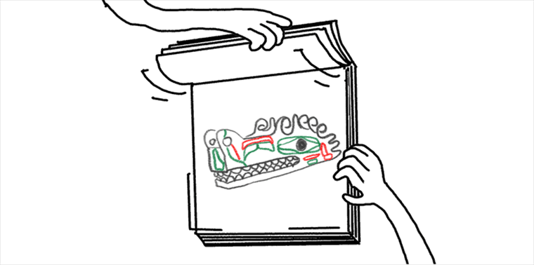

# User Stories Are Not Requirements

"Elephants are not giraffes and user stories are not requirements. They share some traits and you may find them in the same context, but that does not make them the same."[^elephants-are-not-giraffes] This article gets into the differences between user stories and requirements and the challenges of using user stories as requirements. This article supports the main article about [my proposed requirements framework](./why-use-cases-for-agile.md).  

> In the following there are a number of quotes with references to other articles on this topic. I recommend reading all the linked articles to get an even more detailed case against stories as requirements.

Agile is making two bets at the beginning of a project[^two-bets] :
- Given the desire for a fixed schedule, the scope will flex so you don’t want to call anything *required*, especially up front.
- As the project progresses and the users see the software come into being, the desires of the users will change.

This reality shapes the way user stories should be used. Fundamentally user stories are not about what you write down. Their origin is as a placeholder for a conversation with the users, written down on an index card. The goal of a user story is to enable us to have the conversations to understand what is really needed and implement it. By using stories in this way we're setting ourselves up to have the needed scope flex in what we build. We're prioritizing common understanding between the user and the product team over a perfect requirements specification written as a story.[^common-understanding]

    [^elephants-are-not-giraffes]: See [User stories are not requirements](https://blog.crisp.se/2016/01/07/perlundholm/user-stories-are-not-requirements)

    [^common-understanding]: This paragraph is a quote from [User Stories are ill-suited for expressing requirements](https://mdalmijn.com/p/user-stories-are-ill-suited-for-expressing-requirements). This article presents details about how user stories are abused and how splitting the real user stories into implementable chunks pulls us away from the real requirements. 

    [^two-bets]: This statement and the following bullets are quotes from [User Stories Ain’t Requirements](https://www.construx.com/blog/user-stories-aint-requirements/)

So how should we use stories? User stories are best used as planning instruments. We prioritize by user stories, we decide in which sprint we will try to implement them, and we may estimate them[^estimation-is-waste]. All typical for a planning instrument.
- They represent small increments of valued functionality that can be developed in a period of a day to a week. 
- They need little or no maintenance and can be thrown away after implementation.
- They, and the code and tests that is created quickly thereafter, should serve as inputs to and refinements of the requirements documentation, which is developing incrementally as well.

    [^estimation-is-waste]: It's a separate and big topic, but story estimation is almost always a waste of time.

When we plan work as stories we step away from requirements and enter the world of experiments. An experiment is work that aims at proving a hypothesis. Once proven we move on to the next hypothesis and experiments.[^hypothesis]

    [^hypothesis]: This paragraph is a great way to think about user stories and is taken from: [User Stories are not requirements](https://www.5dvision.com/post/user-stories-are-not-requirements/). The rest of that article makes the case for using user stories to avoid the need for requirements. That line of thinking isn't applicable to the requirements framework ideas proposed in [my proposed requirements framework](./why-use-cases-for-agile.md).

If you are doing agile with user stories in anything close to the right way then it isn't possible to understand the solution by reading the completed stories in the work management system, e.g., Jira, Polarian or a similar story tracker. Stories only make sense as requirements when assembled into the proper sequence of events, playing out over time in the correct order. Like one of those flip book animations that you made at school. 

Stories, once delivered, have no further value as documentation of the system’s behavior. Useful requirements documentation, on the other hand, describes how the system behaves now -- not the incrementally created, flip book of history of how it evolved to behave like it does.  

In a project I recently completed, there were stories about how to identify sites and subjects on a clinical trial. The evolution of these stories shows how hypotheses were created and experiments conducted. Many of the experiments failed as we moved on the path to learning what the requirements really were. The work played out as follows:
- For Iteration 1 the site and subject stories were identified as well understood, easy to implement, and small.
- The team implemented (a.k.a. did an experiment) and within that iteration made several updates to the story and its acceptance criteria in an attempt to to prove the hypothesis of what was needed.
- Demos were given and ultimately it was decided that agreement on what was needed could not be reached. We learned it was not well understood, not easy, but possibly still small.
- In later Iterations, multiple hypothesizes of what a good-enough story for site & subject were given, implementations done, and each was rejected.
- Eventually, a dramatically more flexible version was implemented as we  ultimately learned what the real requirements are.

Site & subject are very simple features compared to the rest of the scope of the release of that product. Virtually every other feature evolved in a similar way, e.g., we re-implemented parts of every story/epic in every iteration through the end of the release. This is a common situation on most projects. It's actually a good thing because it is a big part of how we ultimately learn what the real requirements are. Managing the cost of incremental learning and turning around updates fast enough to keep the users interested is a major challenge. Meeting that challenge is in no small part managed by rapid cycles of defining small stories (hypotheses), implementing them (experiments).

The amount of requirements churn in the above example combined with a desired way-of-working where we have many small stories, highlights the challenge of getting a good requirements document from the stories in the work management system. I've seen many product teams try to put all of the requirements details in the stories in the work management system. This results in the following kinds of problems:
- The same story stays active across many iterations because it keeps getting updated with the 'new requirements' we discovered. If the goal is to produce a document from the stories in the work management system the need to obsolete the earlier versions of the stories becomes a painful amount of work.
- New stories are created only containing the new requirements leaving us with the details scattered across many versions of stories. A variation on this is new versions of the same story with only the new requirements which results in the same problems.
- Putting acceptance criteria in the stories. Acceptance criteria changes even more than the stories making the above problems with keeping the stories in the work management system even worse. 
- The work to capture and keep up to date all the details in the stories dramatically slows down the story creation, review, and evolution. We need to either accept the slow down or allow the details to get filled in later. 
- Using epics and features to group the user stories in the work management system. This helps with organizing work management but doesn't solve the requirements management problem. Epics should be changing to reflect the changes at story level. So the same churning requirements problem happens at this higher level. Using just the epic is not enough detail for the requirements so we still need to deal with all the requirements details problems.
- Requirements traceability to design is another frequently important, and sometime regulatory necessity. Tracing from stories to design is difficult because a reasonable granularity of topics in design documents results in many stories tracing to many parts of the design in messy ways. Rather than stories, an organized set of requirements traces cleanly to the design documentation.

Beyond the requirements management problems, the above problems limit the effectiveness of the work management system. We want to make it easy to track and evolve the work. Anything that complicates that leaves us unable to manage the work effectively. We are much better when we use the work management system for the agile process it excels at rather than trying to make it also be an agile requirements management tool. Work management systems that are extended to try to do both work and comprehensive requirements management become painfully complex to use. As advocated in the main article, the ideal approach is to find an agile requirements framework that is separate from the work management. 

The bottom line is that user stories are *planning instruments*, not requirements. Not working in a way that acknowledges this frequently leads to a mess that can compromise delivery and subsequent regulatory review of a product. 

