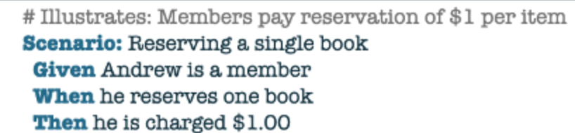
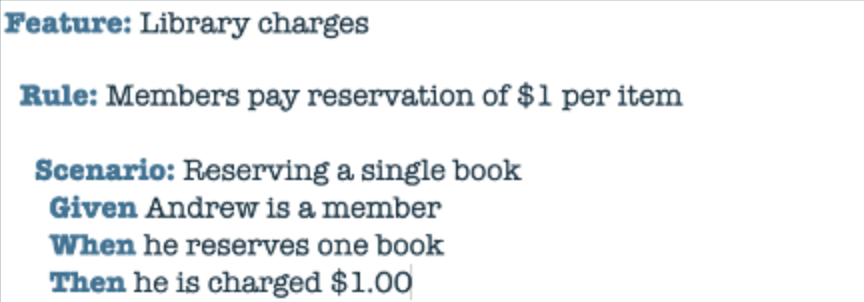
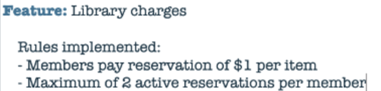
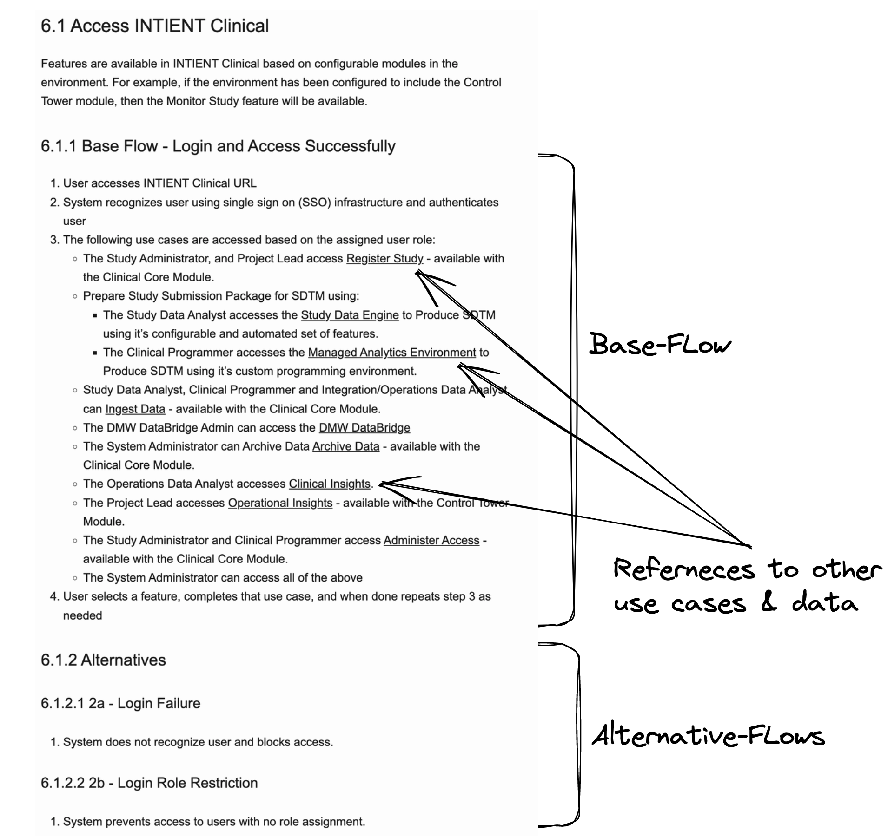
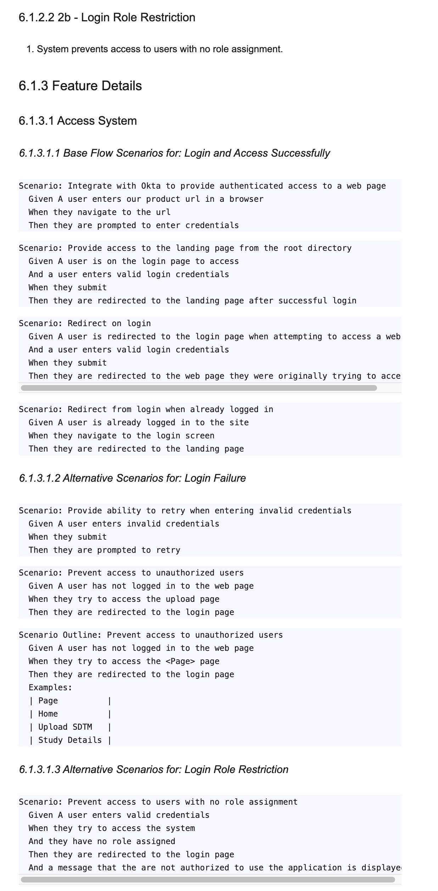
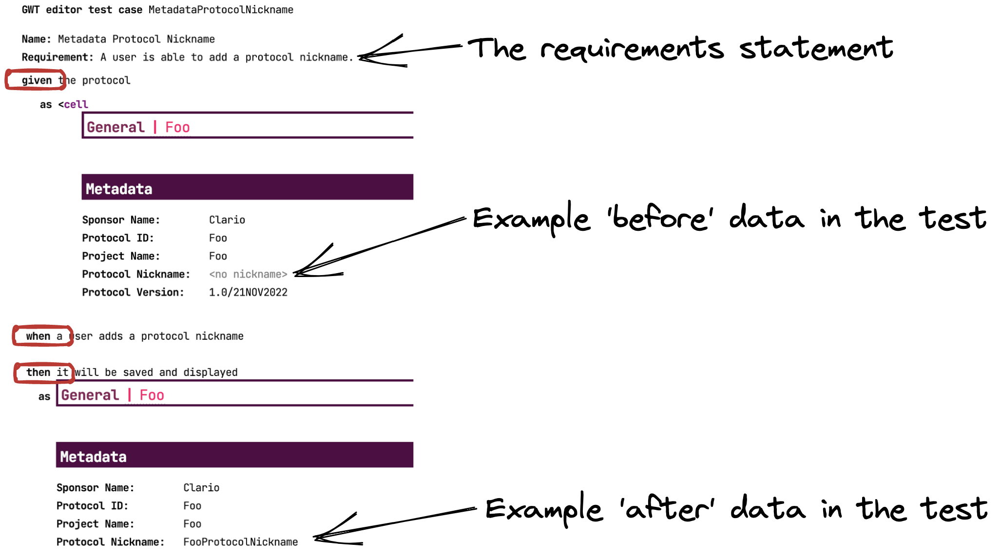
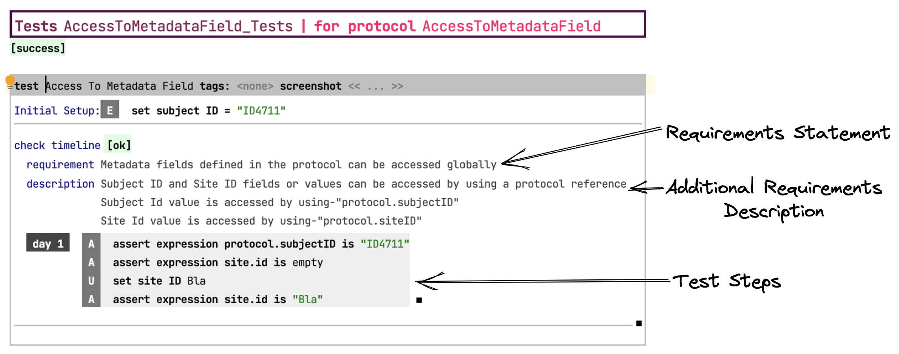

[TOC]

# Organizing and Managing BDD Scenarios As Your Detailed Requirements 

This article provides recommendations on organizing and managing your BDD scenarios so they can serve as the detailed requirements. It provides additional details to support the main article about [my proposed requirements framework](../why-use-cases-for-agile.md). The fundamental idea in the proposed framework is to capture the requirements details in your BDD scenarios. To do this each use case is followed by a 'Detailed Requirement Statements' sub-section that lists detailed requirements statement. These statements come from the BDD scenarios. *This is the secret to how we capture all the details but keep the requirements document minimal.* 

There are two main points:
- Investing in the organization and writting of your BDD scenarios
- Technical approaches to producing the presentation of the combination of the use-case-based requirements and the BDD scenarios[^requirements-presentation]

  [^requirements-presentation]: Depending on the technical approach selected the 'presentation' of the integrated requirements can take a variety of forms, e.g., a generated markdown, html, pdf, MS-Word document or some combination of these forms. I'll just say 'presentation' to avoid dealing with these details until the technical section.

## Investing in Your Scenarios

The biggest thing needed to make the proposed use of BDD Scenarios as detailed requirements work, is continuous investment in the scenarios.  You must:
- Write and re-write them with a focus on understandability.
- Refactor to eliminate duplication, overlap, and redundancy, e.g., scenarios that cover simple early features that are now covered by more complex examples could be deleted
- Keep the text up to date with the current implementation
- Move them to files that reflex the up-to-date use case structure
- Regularly generate the presentation of the use cases and the scenarios under them to verify they tell the story of the product features, e.g., at the end of each iteration or significant feature completion.

Beyond requirements presentation, you need to do the above as part of making your agile way-of-working succeed. If you don't, you'll start to slow down due to poor understanding of the requirements and struggle to determine why tests fail. 

The next biggest thing you need to do is decide on how you'll capture the requirements statements in the scenarios. The Given-When-Then structure of BDD Scenarios is designed to express detailed examples. You must find a way to also write a requirements statement that is at a level above the details of the example. It's critical for [my proposed requirements framework](../why-use-cases-for-agile.md)that this statement of requirements be written in a structured way so that tools can process it, e.g., find and extract it for insertion into a comprehensive requirements presentation. Exactly how best to do this depends on the specific tool used for writing and executing the scenarios. Possible approaches include:
- Use the text that describes the Scenario or the combination of that and a comment directly above it, e.g.,[^Gherkin-Rules-Examples] 

- If you are using a tool that has the more recent Gherkin syntax extension, use the text of the Rule, potentially in combination with the scenario description.

  
- Use the Feature description and the comments allowed after it. This has the most flexibility but I don't think it scales to real use because it requires too many separate feature files. 

 
- Use some special BDD syntax extension of the tool you are using. The ultimate form of this is defining your own syntax for the BDD Scenarios. See the [Using A Custom BDD Approach](#using-a-custom-bdd-approach)

Writing, editing, refactoring scenarios is the job of the entire team in an on-going cycle: 
- Customers/Users/Product-Managers working with Analysts create the initial examples ideally in collaboration with the representative people from the rest of the product team
- Developers and QA team members expand and refine the examples

You need to pick an approach to capturing the requirements details in the scenarios that the team buys into so this cycle is successful.  

[^Gherkin-Rules-Examples]: The examples are taken from the [^Gherkin-Rules]:(https://cucumber.io/blog/bdd/gherkin-rules/) blog.

## Technical Approaches

The tool used to define and execute your BDD Scenarios tends to dominate your approach to capture of the requirements details. The major options are:

- **Cucumber Family** - A an open source tool based primarily on the [Gherkin language](https://cucumber.io/docs/gherkin/reference/), e.g., [Cucumber](https://cucumber.io/), [Behave](https://behave.readthedocs.io/en/latest/), [SpecFlow](https://specflow.org/)
- **Commercial Cucumber Family** - A commercial tool that includes support for [Gherkin language](https://cucumber.io/docs/gherkin/reference/), e.g., [Katalon](https://katalon.com/), [SmartBear](https://smartbear.com/)
- **Custom BDD Approach** - A tool that works in the spirit of Gherkin BDD but uses a different way to express, manage, and execute the scenarios. This can be something that is tailored to working well with a specific a programming language,  e.g., R-[Spec](https://rspec.info/), [Concordian](https://concordion.org/index.html), [Describe](https://testthat.r-lib.org/reference/describe.html), or it can be a custom framework the team builds for the product. This last option is very powerful and will be discussed later.
- **ALM Product** - An Application Lifecycle Management (ALM) product that captures both the requirements and the BDD Scenarios, e.g., [Polarion](https://polarion.plm.automation.siemens.com/)[^Why-Polarion]

  [^Why-Polarion]: I'm only listing Polarion because it was used on my last project. I avoid these kinds of products so I don't have current knowledge of others. If they don't break the user-stories-are-not-requirements rule then they probably work similar to 

The following sub-sections discuss each of these options in the context of [my proposed requirements framework](../why-use-cases-for-agile.md). 

### Using the Cucumber Family 

The following shows a use case from a real product[^INTIENT-Clinical]. Don't focus on the details, instead just note how it follows the proposed standard use case structure of a base flow with alternatives as well as having steps that can include links to other use cases and data.

[^INTIENT-Clinical]: The product is [INTIENT Clinical](https://www.accenture.com/us-en/services/life-sciences/intient-clinical-platform) 

The following shows and example of the BDD scenarios that act as detailed requirements statements. Don't focus on the details, instead note that:
- The last alternative from the above picture is duplicated to show that these scenarios would be placed directly in the document following the use case. 
- This is an automatically generated document. Details of how it was generated are covered later.
- There is a header for the base flow and each alternative flow. Each header is followed by the scenarios for that flow. This shows how the use case flows provide the requirements framework and capture the higher level requirements.

This is an example of using just the scenario description and it's Given-When-Then text as the detailed requirements. It works and is relatively easy to setup and manage but it tends to result in long lists of detailed requirements because there can be a lot of text in the Given-When-Thens. This problem is why it's desirable to put an overall requirements statement above the Given-When-Then and only show that overall statement in the requirements presentation.

The presentation is straightforward because the use cases are in a markdown text file and the scenarios are just well structured text files. The specifics of the approach to reporting on this example project were:
- Put a structured reference to the feature file containing the scenarios into the use case document, e.g., a regular markdown link that points to the feature file. 
- Organize the feature files by use case and alternative flows. We put structured comments into the feature files so that a single feature file could contain multiple / all scenarios for a use case's flows.
- Pre-process the markdown file, e.g., we wrote a small python script that understands the folder, file and comment structure. Links to feature files always follow a "### Requirements Details" heading. The file pointing to each such feature file link is pre-processed by the python script to make it ready for reporting. 
- Production of the presentation involves using something like [pandoc](https://pandoc.org/) to convert the combination of markdown and feature files into HTML, pdf, etc.

I don't recommend doing a lot of work to organize the list of these requirements statements. I haven't even tried to break them out by alternative flows. Instead I have just one list per use case. This is an example of an effort vs. benefit vs. risk trade-off. The BDD scenarios should be evolving even more than the use cases and trying to keep them highly organized has proven unsustainable. Instead, the place to invest is the requirements statements in the BDD scenario. It's worth a lot of investment to make them readable and to fit into the context of the use case they are under.
Under each u

### Using A Commercial Cucumber Family Approach

Because of my desire to have everything in git as text files and have complete control over the presentation of the requirements, I have actively avoided using commercial products supporting Cucumber or other BDD approaches. I expect they do something similar to what the framework does but in a more elaborate and proprietary way. If the tool selected by your team is open enough you can potentially get to results similar to [my proposed requirements framework](../why-use-cases-for-agile.md).

### Using A Custom BDD Approach

I struggle with the restrictions of Gherkin syntax and standard BDD reports. Gherkin is a Domain Specific Language (DSL) for expressing and executing BDD Acceptance test scenarios. On my most recent project we created a custom DSL for our BDD scenarios. In the first example below the key point for the requirements framework is that the DSL has a *requirements statement* separate from the definition of the scenario.   

In the second example there is both a requirements statement and a description. The statements and descriptions from these scenarios are what is included under the use cases. This enables a much better presentation of the comprehensive requirements. 

### Teams Need Freedom to Pick or Build Their Tools 

Using an existing BDD tool is the easy path to using [my proposed requirements framework](../why-use-cases-for-agile.md). I see mandates to use the same process and tools as the norm in most enterprises and I think this is a mistake. I strongly believe that every project is different enough that the team should be allowed to select and create, as needed, the tools to support their agile way-of-working with the proposed requirements framework. Whether this simply means implementing some scripts to generate the combined use case and BDD scenario presentations or building a building a full DSL for expressing, executing, and generating the presentations of their scenarios. The full scope of doing this is beyond what can be covered in this article. To emphasize the point that the team needs to select and build their own tools, I end by saying that the power that comes from enabling the users to directly and optimally express their scenarios via a DSL is unlike anything I've seen using the existing Cucumber-family tools.

## Requirements to Test Traceability

 To see coverage of features, traceability from requirements to tests is desirable in every product. It's mandated in many regulated environments such as the Life Science domain. It's frequently a painful process where things like a traceability matrix is created that maps requirements numbers to test IDs. Don't fall into the trap of using the stories in the work management system to build the traceability because [user stories are not requirements](stories-are-not-requirements.md) so the traceability will be technically correct but a conceptual mess. Traceability comes for free in the proposed framework because the tests are part of the requirements. If needed to align with existing SDLC or SOP demands, a simple program, similar to the one that creates the combined presentation of the use cases and the scenarios, can publish the traceability as a matrix in a spreadsheet.
 
  
  