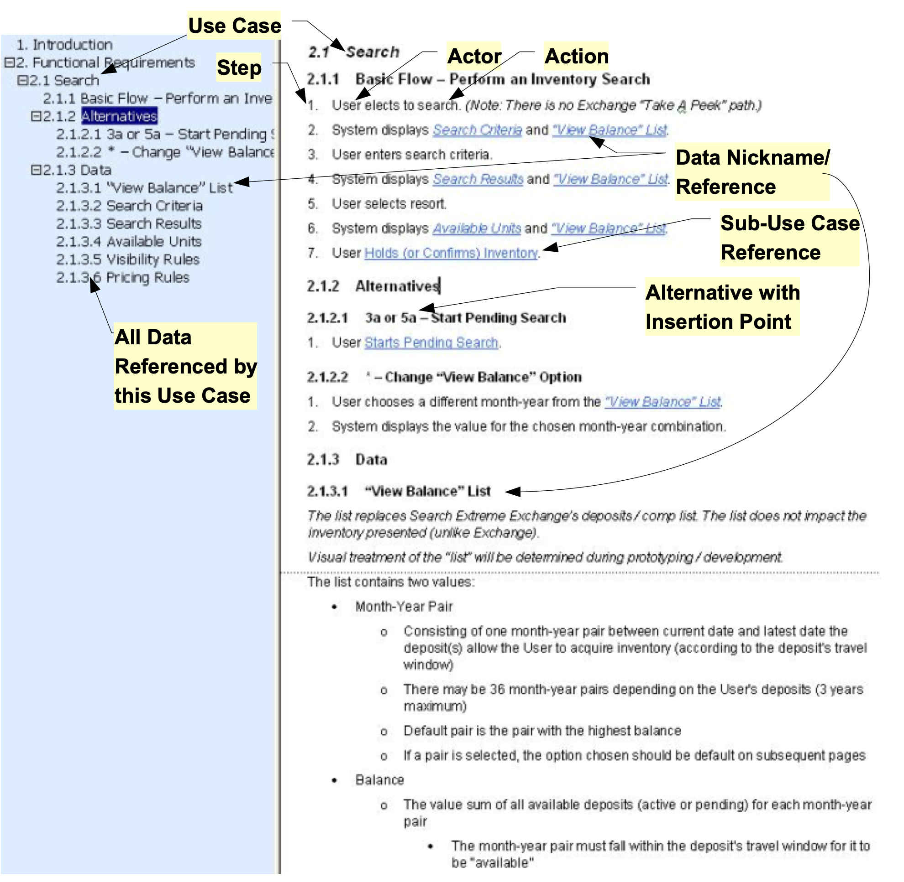

## An Agile Way of Writing Use Cases

## Use Case Organization and Format
  

- Each use case has a unique name.  Each step in a use case is assigned a number. This serves to both identify and sequence the steps. All steps are written in the form: Actor does Action, e.g., "User selects accesses Configuration Designer”.
- Each use case starts with a Basic Flow that is the most common or simplest sequence of steps. It is usually the case where nothing goes wrong.
- A use case does not include decisions or branches. Instead at any point where there is an alternative, an Alternative Flow is defined. The alternative is assigned an identifier that indicates where it can optionally be inserted into the Base Flow. For example, if the Base Flow had steps 1-3, then an alternative that can be done at step 2 would be assigned the id of “2a – Name of Alternative”. Subsequent alternatives that can be done at the same place would be assigned ids like 2b, 2c, etc. If an alternative can occur in multiple places it is assigned the id of “*” (using the asterisk as a wildcard). If an alternative is a complete replacement for the basic flow it is assigned an id like 1a and 1b to indicate that the alternative replaces step 1 of the basic flow.  
- One use case can refer to another (a sub-use case). Such references are formatted with the name of the referenced use case underlined, as if it were a hyper-link (e.g., Do Something).  The name of the use case is changed slightly to make the step more readable. For example, a step that referenced the Configure Contract Load use case would be written: ‘User Configures Contract Load’.
- If a step in a use case accesses complex data, the data is given a nickname. The nickname is formatted in underlined italics (e.g., Contract Load Configuration). The definition of the data is placed in a separate ‘Data’ section below the use case.

Data that is shared across multiple use cases is defined in one place.  When an item of data is referenced by a use case the definition of the data in the ‘Data’ section will say ‘Defined in Common Data section’.  The data can be found in the ‘Common Data’ section at the beginning of the current document.  This is done for data that is used by multiple use cases in the current document.

Usage Note: The references to sub-use cases and the shorthand names of the data may look like hyperlinks but clicking on them doesn’t jump to their section. The easiest way to navigate to them is to keep the document map open (on the main menu click ViewDocument Map / Navigation Pane). Find a referenced name by scrolling the document map and clicking on it to jump there.
- Some use case steps that are external to the application (manual steps) may be included because they are an integral part of the sequence. These steps are tagged with [MS] to indicate they are Manual Steps, Not Tested during Technical Testing. These steps  will be tested in User Acceptance Testing where the emphasis is on business processes but not in Unit and System Testing where the emphasis is on technical system testing.
The following figure shows an annotated example of a use case formatted as described above.  The document map showing the organization of the use case is also displayed as suggested in the above usage note. 
 

The following is a larger but still simplified example of some use cases for a product to design configuration files. The idea is that a configuration is made up of many parts, each with a unique structure that the user needs to populate. 

 
---

>#### Access Configuration Designer
>
>##### Base Flow - Access Designer
>
>1. User accesses Configuration Designer by browsing to [designer.com]>(http://designer.com) and enters valid credentials.
>2. User [Opens or Creates a Configuration](#open-or-create-configuration).
>3. User [Views or Edits Configuration](#view-and-edit-configuration).
>4. User closes the Configuration.
>5. User logs-out of the Designer 
>
>##### Alternatives
>
>###### 1a - Setup Credentials
>
>1. User starts the Designer for the first time and is prompted to setup >their credentials.
>2. Continue at step 2
>
>###### 1b - Invalid Credentials
>
>1. User enters invalid credentials 
>2. System notifies them of the error and re-prompts up to the allowed >number of times before lock-out.
>3. Continue at step 1
>
>##### Detailed Requirement Statements
>
>This section lists the requirements statement / rule for each BDD scenario associated with the use case....
>
>
>#### View and Edit Configuration
>
>###### Base Flow - View and Edit Configuration
>
>1. User does any of the following by navigating to the appropriate part of >the configuration.
>   - [Views or Edits Part-A](#view-or-edit-part-x)
>   - [Views or Edits Part-B](#view-or-edit-part-x)
>   - [Views or Edits Part-C](#view-or-edit-part-x)
>   - [Imports a Configuration Part](#reuse-a-form-r12)
>   - [Views PDF view of Configuration](#view-or-edit-pds)
>   - [Views the Audit Trail](#view-audit-trail)
>   - [Views Online Help](#view-online-help)
>
>##### Data
>
>###### Configuration Tree
>
>The Tree provides a view of the parts of the Configuration, navigation to >those parts, and operations to create or delete parts where appropriate. >The following is the structure of and the operations available on the >items in the Protocol Tree:
>
>- Config 'Name' - with sub-folder for each of the following that when >clicked navigate to and expand to show details of that part of the Config:
>  - Part-A
>    - Subparts would be listed here but are omitted to keep the example >simple...
>  - Part-B
>    - Subparts...
>  - Part-C
>    - Subparts...
>  - PDF
>  - Audit Trail
>
>- Operations:
>  - Part-A
>    - List the operations available on this tree node and its subparts. >Details omitted to keep the example simple...
>  - Part-B
>    - ...
>
>##### Detailed Requirement Statements
>
>BDD scenario associated with the use case....
>
>#### View and Edit Part-A
>
>###### Base Flow - View and Edit Part-A
>
>1. User views or edits the Part-A fields
>
>##### Detailed Requirement Statements
>
>BDD scenario associated with the use case....

---